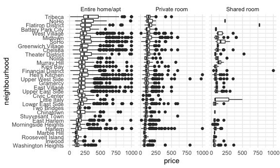

Case Study
================
Tanya Butt

``` r
library(tidyverse)
```

    ## ── Attaching packages ─────────────────────────────────────── tidyverse 1.3.1 ──

    ## ✓ ggplot2 3.3.5     ✓ purrr   0.3.4
    ## ✓ tibble  3.1.4     ✓ dplyr   1.0.7
    ## ✓ tidyr   1.1.3     ✓ stringr 1.4.0
    ## ✓ readr   2.0.1     ✓ forcats 0.5.1

    ## ── Conflicts ────────────────────────────────────────── tidyverse_conflicts() ──
    ## x dplyr::filter() masks stats::filter()
    ## x dplyr::lag()    masks stats::lag()

``` r
library(leaflet)
library(p8105.datasets)
knitr::opts_chunk$set(
  fig.width = 6,
  fig.asp = .6,
  out.width = "90%"
)

theme_set(theme_minimal() + theme(legend.position = "bottom"))

options(
  ggplot2.continuous.colour = "viridis",
  ggplot2.continuous.fill = "viridis"
)

scale_colour_discrete = scale_colour_viridis_d
scale_fill_discrete = scale_fill_viridis_d
```

## Load a dataset

``` r
data("nyc_airbnb")
force(nyc_airbnb)
```

    ## # A tibble: 40,753 × 17
    ##          id review_scores_location name       host_id host_name neighbourhood_g…
    ##       <dbl>                  <dbl> <chr>        <dbl> <chr>     <chr>           
    ##  1  7949480                     10 City Isl…   119445 Linda & … Bronx           
    ##  2 16042478                     NA WATERFRO…  9117975 Collins   Bronx           
    ##  3  1886820                     NA Quaint C…  9815788 Steve     Bronx           
    ##  4  6627449                     10 Large 1 … 13886510 Arlene    Bronx           
    ##  5  5557381                     10 Quaint C… 28811542 Phoebe    Bronx           
    ##  6  9147025                     10 Cozy Cit…   403032 Diane     Bronx           
    ##  7 11675715                     10 Cozy 1 B… 56714504 Josue     Bronx           
    ##  8   715270                      9 2 Beds/Q…  3684360 Enrique   Bronx           
    ##  9 17876530                     10 Spacious… 11305944 Yahaira   Bronx           
    ## 10   182177                      9 PRIVATE …   873273 Christia… Bronx           
    ## # … with 40,743 more rows, and 11 more variables: neighbourhood <chr>,
    ## #   lat <dbl>, long <dbl>, room_type <chr>, price <dbl>, minimum_nights <dbl>,
    ## #   number_of_reviews <dbl>, last_review <date>, reviews_per_month <dbl>,
    ## #   calculated_host_listings_count <dbl>, availability_365 <dbl>

*How many rentals are there? Of what type? In what places? *Is price
correlated with review score? *Which neighborhood is most popular? Most
expensive? *Which neighborhood has the highest reviews? *Is availability
related to price? *Is room type related to neighborhood? \*Is length of
stay related to neighborhood group (borough)?

``` r
nyc_airbnb =
  nyc_airbnb %>% 
  mutate(stars = review_scores_location / 2) %>% 
  rename(borough = neighbourhood_group)
```

Let’s try to count things:

``` r
nyc_airbnb %>% 
  janitor::tabyl(borough, room_type)
```

    ##        borough Entire home/apt Private room Shared room
    ##          Bronx             192          429          28
    ##       Brooklyn            7427         9000         383
    ##      Manhattan           10814         7812         586
    ##         Queens            1388         2241         192
    ##  Staten Island             116          144           1

``` r
nyc_airbnb %>% 
  count(borough, room_type) %>% 
  pivot_wider(
    names_from = room_type,
    values_from = n
  )
```

    ## # A tibble: 5 × 4
    ##   borough       `Entire home/apt` `Private room` `Shared room`
    ##   <chr>                     <int>          <int>         <int>
    ## 1 Bronx                       192            429            28
    ## 2 Brooklyn                   7427           9000           383
    ## 3 Manhattan                 10814           7812           586
    ## 4 Queens                     1388           2241           192
    ## 5 Staten Island               116            144             1

Let’s look at price and room type.

``` r
nyc_airbnb %>% 
  ggplot(aes(x = stars, y = price)) +
  geom_point() +
  facet_grid(. ~ room_type)
```

    ## Warning: Removed 10037 rows containing missing values (geom_point).


Price and Neighborhood

``` r
nyc_airbnb %>% 
  filter(borough == "Manhattan") %>% 
  group_by(neighbourhood) %>% 
  summarize(mean_price = mean(price, na.rm = TRUE)) %>% 
arrange(mean_price)
```

    ## # A tibble: 32 × 2
    ##    neighbourhood       mean_price
    ##    <chr>                    <dbl>
    ##  1 Marble Hill               83.6
    ##  2 Inwood                    86.5
    ##  3 Washington Heights        90.1
    ##  4 Morningside Heights      107. 
    ##  5 Harlem                   117. 
    ##  6 Roosevelt Island         122. 
    ##  7 Two Bridges              123. 
    ##  8 East Harlem              128. 
    ##  9 Chinatown                158. 
    ## 10 Upper East Side          172. 
    ## # … with 22 more rows

``` r
nyc_airbnb %>% 
  filter(borough == "Manhattan", price <= 1000) %>% 
  mutate(neighbourhood =
           fct_reorder(neighbourhood, price)) %>% 
  ggplot(aes(x = neighbourhood, y = price)) +
  geom_boxplot() + 
  coord_flip() +
  facet_grid(. ~ room_type) 
```



Price versus location

``` r
nyc_airbnb %>% 
  filter(price < 500) %>% 
  sample_n(5000) %>% 
  ggplot(aes(x = lat, y = long, color = price)) +
  geom_point()
```


## retry leaflet

``` r
pal = colorNumeric("viridis", NULL)

nyc_airbnb %>% 
  filter(price < 500) %>% 
  sample_n(1000) %>% 
  leaflet() %>% 
  addProviderTiles(providers$CartoDB.Positron) %>% 
  addCircleMarkers(~lat, ~long, radius = 1, 
                  color = ~pal(price))
```
